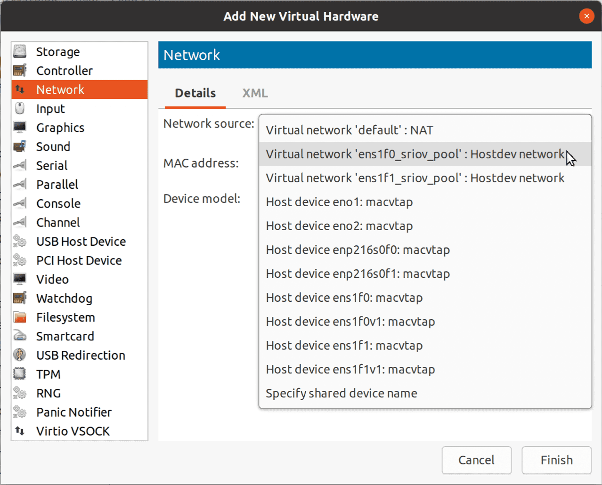
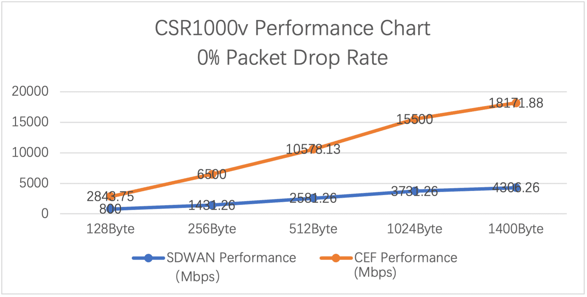

# Cisco CSR1000v KVM SRIOV Setting Guide on Ubuntu 20.04 With NetworkManager

Last Update: February 2, 2021

Author: Rao Weibo

Version:0.9


This guide provides the steps on how to install CSR1000v/Catalyst 8000v on KVM, the setting of SRIOV and KVM tuning.
# Ubuntu 20.04 Installation and Settings
## (1) BIOS settings

| Configuration                        | Recommended Setting |
| ------------------------------------ | ------------------- |
| Intel Hyper-Threading  Technology    | Disabled            |
| Number of Enable Cores               | ALL                 |
| Execute Disable                      | Enabled             |
| **Intel VT**                         | **Enabled**         |
| **Intel VT-D**                       | **Enabled**         |
| Intel VT-D coherency support         | Enabled             |
| Intel VT-D ATS support               | Enabled             |
| CPU Performance                      | High throughput     |
| Hardware Perfetcher                  | Disabled            |
| Adjacent Cache Line Prefetcher       | Disabled            |
| DCU Streamer Prefetch                | Disable             |
| Power Technology                     | Custom              |
| Enhanced Intel Speedstep  Technology | Disabled            |
| Intel Turbo Boost Technology         | Enabled             |
| Processor Power State C6             | Disabled            |
| Processor Power State C1 Enhanced    | Disabled            |
| Frequency Poor Override              | Enabled             |
| P-State Coordination                 | HW_ALL              |
| Energy Performance                   | Performance         |

The above settings are from the Installation guide from [Cisco CSR 1000v and Cisco ISRv Software Configuration Guide](https://www.cisco.com/c/en/us/td/docs/routers/csr1000/software/configuration/b_CSR1000v_Configuration_Guide/b_CSR1000v_Configuration_Guide_chapter_0101.html#con_1313827).
Note: some platform such as **Cisco NFVIS**, does not disable the Hyper-Threading.

## (2) Ubuntu 20.04 installation tips
If you need the Gnome GUI, you can install the Ubuntu 20.04 Desktop.
After the system bootup, **‘apparmor’** is recommended to be disabled, otherwise, you may meet **permission denied** when you assign SRIOV devices to the CSR1kV. You need to reboot to take effect.

```shell
sudo systemctl disable apparmor
egrep -o '(vmx|svm)' /proc/cpuinfo | sort | uniq
```
You can find the **vmx** on Intel platform, or **svm** on AMD platform.

```shell
sudo systemctl stop ufw
systemctl disable ufw
```

`cat /etc/sysctl.conf`
```text
net.ipv4.ip_forward = 1
net.bridge.bridge-nf-call-ip6tables = 0
net.bridge.bridge-nf-call-iptables = 0
net.bridge.bridge-nf-call-arptables = 0
```
```shell
$ sudo apt install qemu-kvm libvirt-clients libvirt-daemon-system bridge-utils virt-manager numactl virt-top
```
After installation, you can check the version

```shell
ubuntu@ubuntu-kvm:~$ libvirtd -V
libvirtd (libvirt) 6.0.0
ubuntu@ubuntu-kvm:~$ qemu-system-x86_64 --version
QEMU emulator version 4.2.1 (Debian 1:4.2-3ubuntu6.11)
Copyright (c) 2003-2019 Fabrice Bellard and the QEMU Project developers
ubuntu@ubuntu-kvm:~$ virt-manager --version
2.2.1
ubuntu@ubuntu-kvm:~$ modinfo kvm-intel
filename:       /lib/modules/5.4.0-62-generic/kernel/arch/x86/kvm/kvm-intel.ko
ubuntu@ubuntu-kvm:~$ modinfo i40evf
filename:       /lib/modules/5.4.0-62-generic/kernel/drivers/net/ethernet/intel/iavf/iavf.ko
version:        3.2.3-k
```
## (3) NIC Setting
In Ubuntu 20.04, we use NetworkManager to config the NIC, you can use nmtui on the terminal, or nmcli.
First, check the netplan.

`cat /etc/netplan/ 00-installer-config.yaml`

Edit the yaml file:
```yaml
# Let NetworkManager manage all devices on this system
network:
  version: 2
  renderer: NetworkManager
```
```shell
sudo netplan apply
```
Then you can set the network config with nmcli or nmtui.

```shell
ubuntu@ubuntu-kvm:~$ sudo nmcli connection modify netplan-eno1 ipv4.method manual ipv4.addresses 10.75.59.50/24 ipv4.gateway 10.75.59.1 ipv4.dns 64.104.123.245
ubuntu@ubuntu-kvm:~$ sudo nmcli connection modify netplan-eno1 connection.id eno1
ubuntu@ubuntu-kvm:~$ sudo nmcli connection up eno1

# Change the connections name to the devices name.

sudo nmcli connection
ubuntu@ubuntu-kvm:~$ sudo nmcli connection
NAME        UUID                                  TYPE      DEVICE
eno1        10838d80-caeb-349e-ba73-08ed16d4d666  ethernet  eno1
enp216s0f0  6556c191-c253-3a5e-b440-c5b071ec29a4  ethernet  enp216s0f0
enp216s0f1  8080672c-5784-375f-8eb9-a6ef57cbd4f7  ethernet  enp216s0f1
ens1f0      58fb5b1f-c10a-3e7a-9ab9-a8c449840ce6  ethernet  ens1f0
ens1f1      2a06a9d9-b761-3bdf-aa0b-3d44fff2158f  ethernet  ens1f1
virbr0      ca7d1e11-a82f-429c-9d91-fc985776232c  bridge    virbr0

#Set the MTU and disable ipv4 for the NIC to enable SRIOV. 

sudo nmcli connection modify ens1f0 ethernet.mtu 9216
sudo nmcli connection modify ens1f0 ipv4.method disabled
sudo nmcli connection up ens1f0
sudo ip link show ens1f0
2: ens1f0: <BROADCAST,MULTICAST,UP,LOWER_UP> mtu 9216 qdisc mq state UP mode DEFAULT group default qlen 1000
link/ether 40:a6:b7:0f:a7:74 brd ff:ff:ff:ff:ff:ff

# Note: This value 9216 of MTU is derived from Cisco NFVIS.
CSP5228-1# show pnic-detail mtu
Name          MTU
=============================
eth0-1        9216
eth0-2        9216
eth1-1        9216
eth1-2        9216
```

# SR-IOV Configuration

## (1) Check the NIC to support SR-IOV

Check the NIC hardware infor.

```shell
sudo lshw -c network -businfo

Bus info          Device      Class          Description
========================================================

pci@0000:3b:00.0  eno1        network        Ethernet Controller 10G X550T
pci@0000:3b:00.1  eno2        network        Ethernet Controller 10G X550T
pci@0000:5e:00.0  ens1f0      network        Ethernet Controller XXV710 for 25GbE SFP28
pci@0000:5e:00.1  ens1f1      network        Ethernet Controller XXV710 for 25GbE SFP28
pci@0000:d8:00.0  enp216s0f0  network        Ethernet Controller XXV710 for 25GbE SFP28
pci@0000:d8:00.1  enp216s0f1  network        Ethernet Controller XXV710 for 25GbE SFP28
```

Check the capabilities of NIC

```shell
sudo lspci -vv -s 5e:00.0 | grep -A 5 -i SR-IOV
	Capabilities: [160 v1] Single Root I/O Virtualization (SR-IOV)
		IOVCap:	Migration-, Interrupt Message Number: 000
		IOVCtl:	Enable+ Migration- Interrupt- MSE+ ARIHierarchy+
		IOVSta:	Migration-
		Initial VFs: 64, Total VFs: 64, Number of VFs: 2, Function Dependency Link: 00
		VF offset: 16, stride: 1, Device ID: 154c
```

## (2) Change the GRUB parameters

```shell
sudo vi /etc/default/grub 
GRUB_CMDLINE_LINUX_DEFAULT="quiet hugepagesz=1G hugepages=64 default_hugepagesz=1G intel_iommu=on iommu=pt isolcpus=1-8,45-52"
```

**Note：The hugepages should be no more than the physical memory, otherwise, it will fail to bootup.**

- **default_hugepagesz=1G hugepagesz=1G hugepages=64** will allocate 64 1GB huge pages at boot, which are **static huge pages**. CSR 1000v will use these static huge pages for best performance.
- **isolcpus=1-8,45-52** will isolate the CPUs cores reserved for CSR 1000v, prevent other processes running on these cores, this can reduce latency for CSR 1000v. You can refer to (1) Check the capability of the platform to get the CPU information.

```shell
sudo update-grub
```

After reboot, check the /proc/cmdline.

```shell
cat /proc/cmdline |grep intel_iommu=on
dmesg |grep -e DMAR -e IOMMU
dmesg | grep -e DMAR -e IOMMU -e AMD-Vi
ubuntu@ubuntu-kvm:~$ cat /proc/cmdline |grep intel_iommu=on
BOOT_IMAGE=/vmlinuz-5.4.0-62-generic root=/dev/mapper/ubuntu--vg-ubuntu--lv ro quiet hugepagesz=1G hugepages=64 default_hugepagesz=1G intel_iommu=on iommu=pt isolcpus=1-8,45-52

ubuntu@ubuntu-kvm:~ $ dmesg |grep -e DMAR -e IOMMU
[    0.020313] ACPI: DMAR 0x000000005DA8EB80 000270 (v01 Cisco0 CiscoUCS 00000001 INTL 20091013)
[    1.954441] DMAR: IOMMU enabled
```

Check the CPU info, all the CPU cores and isolated CPU cores.

```shell
ubuntu@ubuntu-kvm:~$ cat /sys/devices/system/cpu/isolated
1-8,45-52
ubuntu@ubuntu-kvm:~$ cat /sys/devices/system/cpu/present
0-87
```

## (3) VFs Persistence

**NetworkManager way:**

```shell
# nmcli can set the SRIOV, as follow:
sudo nmcli connection modify ens1f0 sriov.total-vfs 2
sudo nmcli connection modify ens1f1 sriov.total-vfs 2

# We can set the MAC address and set the trust on:
sudo nmcli connection modify ens1f0 sriov.vfs '0 mac=b6:4f:02:37:5a:d8 trust=true, 1 mac=26:04:1d:1f:3d:a9 trust=true'
sudo nmcli connection modify ens1f1 sriov.vfs '0 mac=76:6c:4e:16:7f:e2 trust=true, 1 mac=6a:f2:bd:97:71:65 trust=true'
sudo nmcli connection up ens1f0
sudo nmcli connection up ens1f1
```

After reboot, check the dmesg.

```shell
sudo dmesg | grep -i vf
[    6.599304] i40e 0000:5e:00.0: Allocating 2 VFs.
[    6.680111] i40e 0000:5e:00.1: Allocating 2 VFs.
[    6.730167] iavf: Intel(R) Ethernet Adaptive Virtual Function Network Driver - version 3.2.3-k
<< snip >>
[   17.931493] i40e 0000:5e:00.0: Setting MAC b6:4f:02:37:5a:d8 on VF 0
[   18.111781] i40e 0000:5e:00.0: VF 0 is now trusted
[   18.112559] i40e 0000:5e:00.0: Setting MAC 26:04:1d:1f:3d:a9 on VF 1
[   18.291464] i40e 0000:5e:00.0: VF 1 is now trusted
[   18.292231] i40e 0000:5e:00.1: Setting MAC 76:6c:4e:16:7f:e2 on VF 0
[   18.475259] i40e 0000:5e:00.1: VF 0 is now trusted
[   18.475929] i40e 0000:5e:00.1: Setting MAC 6a:f2:bd:97:71:65 on VF 1
[   18.659465] i40e 0000:5e:00.1: VF 1 is now trusted
[   18.728124] iavf 0000:5e:02.0 ens1f0v0: NIC Link is Up Speed is 25 Gbps Full Duplex
[   18.752275] iavf 0000:5e:02.1 ens1f0v1: NIC Link is Up Speed is 25 Gbps Full Duplex
[   18.776329] iavf 0000:5e:0a.0 ens1f1v0: NIC Link is Up Speed is 25 Gbps Full Duplex
[   18.800569] iavf 0000:5e:0a.1 ens1f1v1: NIC Link is Up Speed is 25 Gbps Full Duplex
```

## (4) Check the VFs

You can check the VFs from lspci or ip link commands.

```shell
ubuntu@ubuntu-kvm:~$ sudo lspci | grep -i Virtual
ubuntu@ubuntu-kvm:~$ sudo ip link show | grep -B2 vf
```

Good news is that the VFs names are well related to the physical NICs. For example, **ens1f0v1** is one of the VFs of the physical NIC **ens1f0** .

```shell
ubuntu@ubuntu-kvm:~$ ip link show | grep -E ens1f[0,1]v[0,1] -A 1
9: ens1f0v1: <BROADCAST,MULTICAST,UP,LOWER_UP> mtu 1500 qdisc mq state UP mode DEFAULT group default qlen 1000
    link/ether 26:04:1d:1f:3d:a9 brd ff:ff:ff:ff:ff:ff
10: ens1f1v1: <BROADCAST,MULTICAST,UP,LOWER_UP> mtu 1500 qdisc mq state UP mode DEFAULT group default qlen 1000
    link/ether 6a:f2:bd:97:71:65 brd ff:ff:ff:ff:ff:ff
15: ens1f0v0: <BROADCAST,MULTICAST,UP,LOWER_UP> mtu 1500 qdisc mq state UP mode DEFAULT group default qlen 1000
    link/ether b6:4f:02:37:5a:d8 brd ff:ff:ff:ff:ff:ff
16: ens1f1v0: <BROADCAST,MULTICAST,UP,LOWER_UP> mtu 1500 qdisc mq state UP mode DEFAULT group default qlen 1000
link/ether 76:6c:4e:16:7f:e2 brd ff:ff:ff:ff:ff:ff
```

We can change the MTU to **9216** (or you may not need 9216, 1504 is enough).

```shell
sudo nmcli connection modify ens1f0v0 ethernet.mtu 9216 ipv4.method disabled
sudo nmcli connection modify ens1f0v1 ethernet.mtu 9216 ipv4.method disabled
sudo nmcli connection modify ens1f1v0 ethernet.mtu 9216 ipv4.method disabled
sudo nmcli connection modify ens1f1v1 ethernet.mtu 9216 ipv4.method disabled
sudo nmcli connection up ens1f0v0 
sudo nmcli connection up ens1f0v1
sudo nmcli connection up ens1f1v0
sudo nmcli connection up ens1f1v1
```

The above configs will survive after reboot.

The above configs will survive after reboot.

# Create SR-IOV Virtual Network Adapter Pool

Using this method, KVM creates a pool of network devices that can be inserted into VMs, and the size of that pool is determined by how many VFs were created on the physical function when they were initialized.

## (1) Create an xml file

ubuntu@ubuntu-kvm:~/kvm$ cat ens1f0_sriov_pool.xml

```xml
<network>
   <name>ens1f0_sriov_pool</name> <!-- This is the name of the file you created -->
   <forward mode='hostdev' managed='yes'>
     <pf dev='ens1f0'/>  <!-- Use the netdev name of your SR-IOV devices PF here -->
   </forward>
</network>
```

## (2) Define a network and set to auto start.

```shell
virsh net-define ens1f0_sriov_pool.xml
Sleep 1
virsh net-start ens1f0_sriov_pool
virsh net-autostart ens1f0_sriov_pool
```

ubuntu@ubuntu-kvm:~/kvm$ virsh net-dumpxml ens1f0_sriov_pool

```xml
<network connections='1'>
  <name>ens1f0_sriov_pool</name>
  <uuid>9125a600-6620-4ab6-9a47-8844a61b0918</uuid>
  <forward mode='hostdev' managed='yes'>
    <pf dev='ens1f0'/>
    <address type='pci' domain='0x0000' bus='0x5e' slot='0x02' function='0x0'/>
    <address type='pci' domain='0x0000' bus='0x5e' slot='0x02' function='0x1'/>
  </forward>
</network>
```

## (3) Select the virtual adapter from the pool

It is simple to add an SR-IOV NIC, as follow:



This is equivalent to the following XML:

```xml
    <interface type='network'>
      <mac address='52:54:00:0b:a5:2e'/>
      <source network='ens1f0_sriov_pool'/>
      <model type='virtio'/>
      <address type='pci' domain='0x0000' bus='0x02' slot='0x00' function='0x0'/>
    </interface>
```

After the VM powered on, the network info is as follow:
virsh dumpxml CSR1KV-1

```xml
    <interface type='hostdev' managed='yes'>
      <mac address='52:54:00:0b:a5:2e'/>
      <driver name='vfio'/>
      <source>
        <address type='pci' domain='0x0000' bus='0x5e' slot='0x02' function='0x0'/>
      </source>
      <model type='virtio'/>
      <alias name='hostdev0'/>
      <address type='pci' domain='0x0000' bus='0x02' slot='0x00' function='0x0'/>
    </interface>
```

# Create the CSR1KV VM from virt-manager

From the virt-manager, create a CSR1KV virtual machine step by step, and choose the virtual network interface from the SR-IOV pool.

 


Note: The first interface of csr1kv-1 is configured to **macvtap Bridge mode**, so you do not need to create a Linux bridge. However, csr1kv-1 can not communicate to the Linux host through this interface, but it can go out of the Linux host through the eno1. This is a known issue with macvtap.


After select the Virtual Network Interface, click the **Begin Installation**, and you can shut down the virtual machine.
The actions above will create the **csr1kv-1.xml** file under the directory: **/etc/libvirtd/qemu/**

# KVM Performance Tunning

KVM performance tuning are related to NUMA, Memory Hugepage and vCPU pinning. The main reference is Redhat Linux 7 PERFORMANCE TUNING GUIDE
We will use **virsh edit csr1kv-1** to do the performance tuning.

## (1) Check the capability of the platform

```shell
ubuntu@ubuntu-kvm:~$ virsh nodeinfo
CPU model:           x86_64
CPU(s):              88
CPU frequency:       1000 MHz
CPU socket(s):       1
Core(s) per socket:  22
Thread(s) per core:  2
NUMA cell(s):        2
Memory size:         394929928 KiB
```

ubuntu@ubuntu-kvm:~$ virsh capabilities

```xml
<capabilities>

  <host>
    <uuid>a24f9760-48f1-f34e-a001-a848f08df7bb</uuid>
    <cpu>
      <arch>x86_64</arch>
      <model>Cascadelake-Server-noTSX</model>
      <vendor>Intel</vendor>
      <microcode version='83898371'/>
      <counter name='tsc' frequency='2095078000' scaling='no'/>
      <topology sockets='1' cores='22' threads='2'/>
...
```

From the outputs, we can get the cores of CPU, the NUMA info and the hugepages.

From the outputs, we can get the cores of CPU, the NUMA info and the hugepages.

## (2) NUMA Info

```shell
ubuntu@ubuntu-kvm:~$ numactl --hardware
available: 2 nodes (0-1)
node 0 cpus: 0 1 2 3 4 5 6 7 8 9 10 11 12 13 14 15 16 17 18 19 20 21 44 45 46 47 48 49 50 51 52 53 54 55 56 57 58 59 60 61 62 63 64 65
node 0 size: 192172 MB
node 0 free: 152956 MB
node 1 cpus: 22 23 24 25 26 27 28 29 30 31 32 33 34 35 36 37 38 39 40 41 42 43 66 67 68 69 70 71 72 73 74 75 76 77 78 79 80 81 82 83 84 85 86 87
node 1 size: 193500 MB
node 1 free: 158037 MB
node distances:
node   0   1
  0:  10  21
  1:  21  10 
```


Two CPUs, each has 192GB memory, the NUMA node are node 0 and node 1.

You can also check the NUMA info of the NIC, as follow:

```shell
ubuntu@ubuntu-kvm:~$ sudo lspci -vv | grep Ethernet -A 6
5e:00.0 Ethernet controller: Intel Corporation Ethernet Controller XXV710 for 25GbE SFP28 (rev 02)
	Subsystem: Cisco Systems Inc Ethernet Network Adapter XXV710
	Control: I/O- Mem+ BusMaster+ SpecCycle- MemWINV- VGASnoop- ParErr+ Stepping- SERR+ FastB2B- DisINTx+
	Status: Cap+ 66MHz- UDF- FastB2B- ParErr- DEVSEL=fast >TAbort- <TAbort- <MAbort- >SERR- <PERR- INTx-
	Latency: 0, Cache Line Size: 32 bytes
	Interrupt: pin A routed to IRQ 137
	NUMA node: 0

#Or you can find the numa infor from udevadm.
ubuntu@ubuntu-kvm:~$ sudo udevadm info -ap /sys/class/net/ens1f0 | grep numa
    ATTRS{numa_node}=="0"
    ATTRS{numa_node}=="0"
```

If the memory and NICs are all on numa_node 0, that would be more efficient. Please check the server’s PCI-E slots mapping with the CPU slots.

If the memory and NICs are all on numa_node 0, that would be more efficient. Please check the server’s PCI-E slots mapping with the CPU slots.

## (3) HugePage and Transparent Hugepage

To check the memory info

```shell
ubuntu@ubuntu-kvm:~$ cat /proc/meminfo | grep Huge
AnonHugePages:    133120 kB
ShmemHugePages:        0 kB
FileHugePages:         0 kB
HugePages_Total:      64
HugePages_Free:       56
HugePages_Rsvd:        0
HugePages_Surp:        0
Hugepagesize:    1048576 kB
Hugetlb:        67108864 kB
```

You can change the hugepages on the run time：

```shell
ubuntu@ubuntu-kvm:~$ cat /sys/devices/system/node/node0/hugepages/hugepages-1048576kB/nr_hugepages
32
sudo su -     // switch to root user.
root@ubuntu-kvm:~# echo 64 > /sys/devices/system/node/node0/hugepages/hugepages-1048576kB/nr_hugepages
root@ubuntu-kvm:~# echo 64 > /sys/devices/system/node/node1/hugepages/hugepages-1048576kB/nr_hugepages
```

Check and configure the transparent_hugepage:

```shell
root@ubuntu-kvm:~# echo always > /sys/kernel/mm/transparent_hugepage/enabled
cat /sys/kernel/mm/transparent_hugepage/enabled
[always] madvise never
```

## (4) vCPU Pinning

vCPU pinning can improve the cache meet rate and improve the performance.
You can check the vcpu pinning.
**virsh vcpuinfo csr1kv-1**

## (5) Edit the XML file of the CSR1KV

Run virsh edit csr1kv-1 to edit the parameters.
Please pay attention to the following texts, other parameters might be different.

```xml
  <memoryBacking>
    <hugepages>
      <page size='1048576' unit='KiB'/>
    </hugepages>
    <locked/>
    <nosharepages/>
  </memoryBacking>
  <vcpu placement='static'>8</vcpu>
  <cputune>
    <vcpupin vcpu='0' cpuset='1'/>
    <vcpupin vcpu='1' cpuset='2'/>
    <vcpupin vcpu='2' cpuset='3'/>
    <vcpupin vcpu='3' cpuset='4'/>
    <vcpupin vcpu='4' cpuset='5'/>
    <vcpupin vcpu='5' cpuset='6'/>
    <vcpupin vcpu='6' cpuset='7'/>
    <vcpupin vcpu='7' cpuset='8'/>
    <emulatorpin cpuset='45-52'/> <!-- If Hyper-threading were enabled -->
  </cputune>
  <numatune>
    <memory mode='strict' nodeset='0'/>
  </numatune>
  <cpu mode='host-passthrough' check='none'/>
    <memballoon model='none'/>
```

Please note that, if hyper-threading is enabled in BIOS setting, the parameter “emulatorpin” should be set, the cpuset are from the “virsh capabilities”, for example, siblings='1,45'. When the core 1 is pinned, core 45 should be set in emulatorpin.
From the guide https://libvirt.org/formatdomain.html and https://libvirt.org/kbase/kvm-realtime.html we set the CPU and memory tuning parameters as the highlighted text.

```xml
<domain type='kvm'>
  <name>csr1kv-1</name>
  <uuid>83f90c1c-f0ea-4298-bcdf-3d676de2aeb4</uuid>
  <metadata>
    <libosinfo:libosinfo xmlns:libosinfo="http://libosinfo.org/xmlns/libvirt/domain/1.0">
      <libosinfo:os id="http://centos.org/centos/7.0"/>
    </libosinfo:libosinfo>
  </metadata>
  <memory unit='KiB'>8388608</memory>
  <currentMemory unit='KiB'>8388608</currentMemory>
  <memoryBacking>
    <hugepages>
      <page size='1048576' unit='KiB'/>
    </hugepages>
    <locked/>
    <nosharepages/>
  </memoryBacking>
  <vcpu placement='static'>8</vcpu>
  <cputune>
    <vcpupin vcpu='0' cpuset='1'/>
    <vcpupin vcpu='1' cpuset='2'/>
    <vcpupin vcpu='2' cpuset='3'/>
    <vcpupin vcpu='3' cpuset='4'/>
    <vcpupin vcpu='4' cpuset='5'/>
    <vcpupin vcpu='5' cpuset='6'/>
    <vcpupin vcpu='6' cpuset='7'/>
    <vcpupin vcpu='7' cpuset='8'/>
    <emulatorpin cpuset='45-52'/> <!-- If Hyper-threading were enabled -->
  </cputune>
  <numatune>
    <memory mode='strict' nodeset='0'/>
  </numatune>
  <os>
    <type arch='x86_64' machine='pc-q35-4.2'>hvm</type>
    <boot dev='hd'/>
  </os>
  <features>
    <acpi/>
    <apic/>
    <vmport state='off'/>
  </features>
  <cpu mode='host-passthrough' check='none'/>
  <clock offset='utc'>
    <timer name='rtc' tickpolicy='catchup'/>
    <timer name='pit' tickpolicy='delay'/>
    <timer name='hpet' present='no'/>
  </clock>
  <on_poweroff>destroy</on_poweroff>
  <on_reboot>restart</on_reboot>
  <on_crash>destroy</on_crash>
  <pm>
    <suspend-to-mem enabled='no'/>
    <suspend-to-disk enabled='no'/>
  </pm>
  <devices>
    <emulator>/usr/bin/qemu-system-x86_64</emulator>
    <disk type='file' device='disk'>
      <driver name='qemu' type='qcow2'/>
      <source file='/var/lib/libvirt/images/csr1000v-universalk9.17.02.01v.qcow2'/>
      <target dev='vda' bus='virtio'/>
      <address type='pci' domain='0x0000' bus='0x05' slot='0x00' function='0x0'/>
    </disk>
    <controller type='usb' index='0' model='qemu-xhci' ports='15'>
      <address type='pci' domain='0x0000' bus='0x03' slot='0x00' function='0x0'/>
    </controller>
    <controller type='sata' index='0'>
      <address type='pci' domain='0x0000' bus='0x00' slot='0x1f' function='0x2'/>
    </controller>
    <controller type='pci' index='0' model='pcie-root'/>
    <controller type='pci' index='1' model='pcie-root-port'>
      <model name='pcie-root-port'/>
      <target chassis='1' port='0x10'/>
      <address type='pci' domain='0x0000' bus='0x00' slot='0x02' function='0x0' multifunction='on'/>
    </controller>
    <controller type='pci' index='2' model='pcie-root-port'>
      <model name='pcie-root-port'/>
      <target chassis='2' port='0x11'/>
      <address type='pci' domain='0x0000' bus='0x00' slot='0x02' function='0x1'/>
    </controller>
    <controller type='pci' index='3' model='pcie-root-port'>
      <model name='pcie-root-port'/>
      <target chassis='3' port='0x12'/>
      <address type='pci' domain='0x0000' bus='0x00' slot='0x02' function='0x2'/>
    </controller>
    <controller type='pci' index='4' model='pcie-root-port'>
      <model name='pcie-root-port'/>
      <target chassis='4' port='0x13'/>
      <address type='pci' domain='0x0000' bus='0x00' slot='0x02' function='0x3'/>
    </controller>
    <controller type='pci' index='5' model='pcie-root-port'>
      <model name='pcie-root-port'/>
      <target chassis='5' port='0x14'/>
      <address type='pci' domain='0x0000' bus='0x00' slot='0x02' function='0x4'/>
    </controller>
    <controller type='pci' index='6' model='pcie-root-port'>
      <model name='pcie-root-port'/>
      <target chassis='6' port='0x15'/>
      <address type='pci' domain='0x0000' bus='0x00' slot='0x02' function='0x5'/>
    </controller>
    <controller type='pci' index='7' model='pcie-root-port'>
      <model name='pcie-root-port'/>
      <target chassis='7' port='0x16'/>
      <address type='pci' domain='0x0000' bus='0x00' slot='0x02' function='0x6'/>
    </controller>
    <controller type='pci' index='8' model='pcie-root-port'>
      <model name='pcie-root-port'/>
      <target chassis='8' port='0x17'/>
      <address type='pci' domain='0x0000' bus='0x00' slot='0x02' function='0x7'/>
    </controller>
    <controller type='virtio-serial' index='0'>
      <address type='pci' domain='0x0000' bus='0x04' slot='0x00' function='0x0'/>
    </controller>
    <interface type='direct'>
      <mac address='52:54:00:69:ec:73'/>
      <source dev='eno1' mode='bridge'/>
      <model type='virtio'/>
      <address type='pci' domain='0x0000' bus='0x01' slot='0x00' function='0x0'/>
    </interface>
    <interface type='network'>
      <mac address='52:54:00:0b:a5:2e'/>
      <source network='ens1f0_sriov_pool'/>
      <model type='virtio'/>
      <address type='pci' domain='0x0000' bus='0x02' slot='0x00' function='0x0'/>
    </interface>
    <interface type='network'>
      <mac address='52:54:00:bd:9f:54'/>
      <source network='ens1f1_sriov_pool'/>
      <model type='virtio'/>
      <address type='pci' domain='0x0000' bus='0x08' slot='0x00' function='0x0'/>
    </interface>
    <serial type='pty'>
      <target type='isa-serial' port='0'>
        <model name='isa-serial'/>
      </target>
    </serial>
    <console type='pty'>
      <target type='serial' port='0'/>
    </console>
    <channel type='unix'>
      <target type='virtio' name='org.qemu.guest_agent.0'/>
      <address type='virtio-serial' controller='0' bus='0' port='1'/>
    </channel>
    <channel type='spicevmc'>
      <target type='virtio' name='com.redhat.spice.0'/>
      <address type='virtio-serial' controller='0' bus='0' port='2'/>
    </channel>
    <input type='mouse' bus='ps2'/>
    <input type='keyboard' bus='ps2'/>
    <graphics type='spice' autoport='yes'>
      <listen type='address'/>
      <image compression='off'/>
    </graphics>
    <video>
      <model type='qxl' ram='65536' vram='65536' vgamem='16384' heads='1' primary='yes'/>
      <address type='pci' domain='0x0000' bus='0x00' slot='0x01' function='0x0'/>
    </video>
    <redirdev bus='usb' type='spicevmc'>
      <address type='usb' bus='0' port='2'/>
    </redirdev>
    <redirdev bus='usb' type='spicevmc'>
      <address type='usb' bus='0' port='3'/>
    </redirdev>
    <memballoon model='none'/>
  </devices>
</domain>
```

The parameters are from [Cisco CSR 1000v and Cisco ISRv Software Configuration Guide](https://www.cisco.com/c/en/us/td/docs/routers/csr1000/software/configuration/b_CSR1000v_Configuration_Guide/b_CSR1000v_Configuration_Guide_chapter_0101.html#con_1313827)
After you install the CSR1000v, and edit the XML file, you can run virsh to create the csr1kv.

```shell
cd /etc/libvirtd/qemu
virsh define csr1kv-1.xml
virsh start csr1kv-1
```

## (6) Check CSR1000v’s tunning

ubuntu@ubuntu-kvm:/etc/libvirt/qemu$ virsh list

```shell
 Id   Name       State
--------------------------

 1    csr1kv-1   running

ubuntu@ubuntu-kvm:/etc/libvirt/qemu$ virsh vcpuinfo 1
VCPU:           0
CPU:            1
State:          running
CPU time:       167.0s
CPU Affinity:   -y--------------------------------------------------------------------------------------

VCPU:           1
CPU:            2
State:          running
CPU time:       193.3s
CPU Affinity:   --y-------------------------------------------------------------------------------------

VCPU:           2
CPU:            3
State:          running
CPU time:       152.5s
CPU Affinity:   ---y------------------------------------------------------------------------------------

VCPU:           3
CPU:            4
State:          running
CPU time:       174.3s
CPU Affinity:   ----y-----------------------------------------------------------------------------------

VCPU:           4
CPU:            5
State:          running
CPU time:       260.6s
CPU Affinity:   -----y----------------------------------------------------------------------------------

VCPU:           5
CPU:            6
State:          running
CPU time:       386.0s
CPU Affinity:   ------y---------------------------------------------------------------------------------

VCPU:           6
CPU:            7
State:          running
CPU time:       2189.9s
CPU Affinity:   -------y--------------------------------------------------------------------------------

VCPU:           7
CPU:            8
State:          running
CPU time:       2192.2s
CPU Affinity:   --------y-------------------------------------------------------------------------------
```


From the above outputs, we can find that the vCPUa are pinned to NO. 1 to 8 CPU cores.

```shell
ubuntu@ubuntu-kvm:~$ sudo numastat -c qemu
Per-node process memory usage (in MBs)
PID              Node 0 Node 1 Total

---------------  ------ ------ -----

4391 (qemu-syste   8373      0  8373
5891 (sudo)           4      1     5

---------------  ------ ------ -----

Total              8377      1  8377

ubuntu@ubuntu-kvm:~$ sudo numastat -p 4391
Per-node process memory usage (in MBs) for PID 4391 (qemu-system-x86)
                           Node 0          Node 1           Total
                  --------------- --------------- ---------------
Huge                      8192.00            0.00         8192.00
Heap                        10.00            0.00           10.00
Stack                        0.03            0.00            0.03
Private                    170.70            0.15          170.85

----------------  --------------- --------------- ---------------

Total                     8372.73            0.16         8372.88
```


From the above outputs, the csr1kv-1 are using the memories from node 0.

## (7) Check the vNIC in CSR1KV

```ios
csr1kv-1#show platform software vnic-if interface-mapping
-------------------------------------------------------------

 Interface Name        Driver Name         Mac Addr
-------------------------------------------------------------

 GigabitEthernet3       net_i40e_vf        5254.00bd.9f54
 GigabitEthernet2       net_i40e_vf        5254.000b.a52e
 GigabitEthernet1       net_virtio         5254.0069.ec73
```

The Driver Name net_i40e_vf indicates that the vNIC is a VF from the SR-IOV pool.

CSR 1000v initial configuration and Smart License registration

## (1) CSR 1000v initial config example

Part of the configuration:

```
CSR1000v-1#show sdwan running-config
system
 system-ip             1.1.10.1
 site-id               101
 sp-organization-name  CiscoBJ
 organization-name     CiscoBJ
 vbond 10.75.58.51 port 12346
!
hostname CSR1000v-1
username admin privilege 15 secret 9 $9$4/QL2V2K4/6H1k$XUmRNf.T7t3KDOj/FmoNexpEypCxr482dExXHDnohSI
ip name-server 64.104.123.245
ip route 0.0.0.0 0.0.0.0 10.75.59.1

interface GigabitEthernet1
 no shutdown
 arp timeout 1200
 ip address 10.75.59.35 255.255.255.0
 no ip redirects
 ip mtu    1500
 mtu 1500
 negotiation auto
exit

interface Tunnel1
 no shutdown
 ip unnumbered GigabitEthernet1
 no ip redirects
 ipv6 unnumbered GigabitEthernet1
 no ipv6 redirects
 tunnel source GigabitEthernet1
 tunnel mode sdwan
exit

clock timezone CST 8 0
ntp server x.x.x.x version 4

sdwan
 interface GigabitEthernet1
  tunnel-interface
   encapsulation ipsec
   allow-service sshd
  exit
```

## (2) Commands to check the status

```
show sdwan control local-properties
show sdwan control connections
show sdwan control connection-history
show sdwan running-config
show sdwan bfd sessions
show sdwan omp peers
show sdwan omp routes
```

## (3) CSR 1000v Smart License Registration

Before Smart License registration, you need ：
1、 CSR 1000v’s control connections are up；
2、 Configure ip http client source-interface GigabitEthernet2
3、 If the version is 16.12.x and bellow, you need to allow service all
sdwan interface GigabitEthernet2 tunnel-interface allow-service all 
In the 17.2.x and above versions, there is an allow-service https
4、 CSR 1000v can access URL：https://tools.cisco.com/its/service/oddce/services/DDCEService
The command license smart register idtoken xxxxxx will do the registration.
You can find the idtoken from your Smart Account smart license inventory.
show license status to check the status.

```
CSR1000v-1#show platform hardware throughput level
The current throughput level is 200000000 kb/s
```

# Performances and limitations

## (1) The performance of the SR-IOV

A performance test was done after the SR-IOV setup, the CSR1KV was configured as 8vCPU and 8G Memory, the packet drop rate was 0%.

| Packet Site | SDWAN Performance (Mbps) | CEF Performance (Mbps) |
| ----------- | ------------------------ | ---------------------- |
| 128Bytes    | 800                      | 2843.75                |
| 256Bytes    | 1431.26                  | 6500.00                |
| 512Bytes    | 2581.26                  | 10578.13               |
| 1024Bytes   | 3731.26                  | 15500.00               |
| 1400Bytes   | 4306.26                  | 18171.88               |



Note: **These test results are not to represent the official performance data. Different servers and network cards may have different test results. The above data is for demo only.**

## (2) The limitation of the SR-IOV

The main limitation of the SR-IOV is the number of VLANs on each VF, the maximum VLAN of an VF is limited to 63 in ixgbevf.
So, the active number of sub-interfaces on an interface of the CSR1KV that uses the SRIOV VFs is limited to 63.
There is some notes in the Cisco CSR 1000v and Cisco ISRv Software Configuration Guide:

> SR-IOV (ixgbevf)
> Maximum VLANs: The maximum number of VLANs supported on PF is 64. Together, all VFs can have a total of 64 VLANs. (Intel limitation.)
> SR-IOV (i40evf)
> Maximum VLANs: The maximum number of VLANs supported on PF is 512. Together, all VFs can have a total of 512 VLANs. (Intel limitation.) Per-VF resources are managed by the PF (host) device driver.

# References

https://access.redhat.com/documentation/en-us/red_hat_enterprise_linux/7/html-single/performance_tuning_guide/index


https://computingforgeeks.com/how-to-create-and-configure-bridge-networking-for-kvm-in-linux/


https://software.intel.com/content/www/us/en/develop/articles/configure-sr-iov-network-virtual-functions-in-linux-kvm.html


https://linuxconfig.org/install-and-set-up-kvm-on-ubuntu-20-04-focal-fossa-linux


https://kifarunix.com/how-to-fix-qemu-kvm-not-connected-error-on-ubuntu-20-04/


https://linuxconfig.org/how-to-disable-apparmor-on-ubuntu-20-04-focal-fossa-linux


**CSR1000v SD-WAN Installation on KVM** by Jean-Marc Barozet
